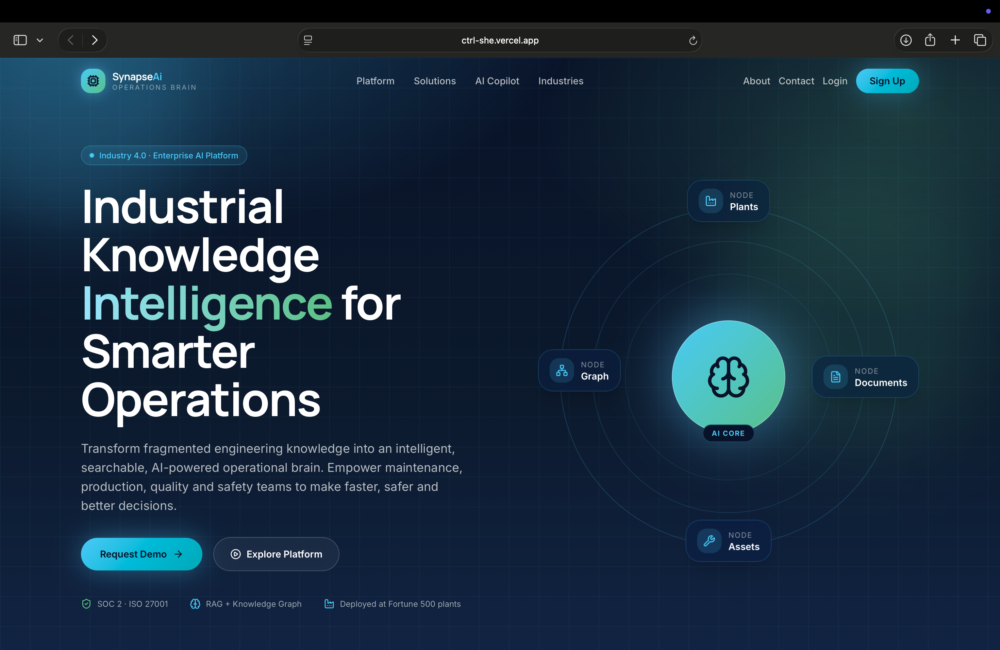
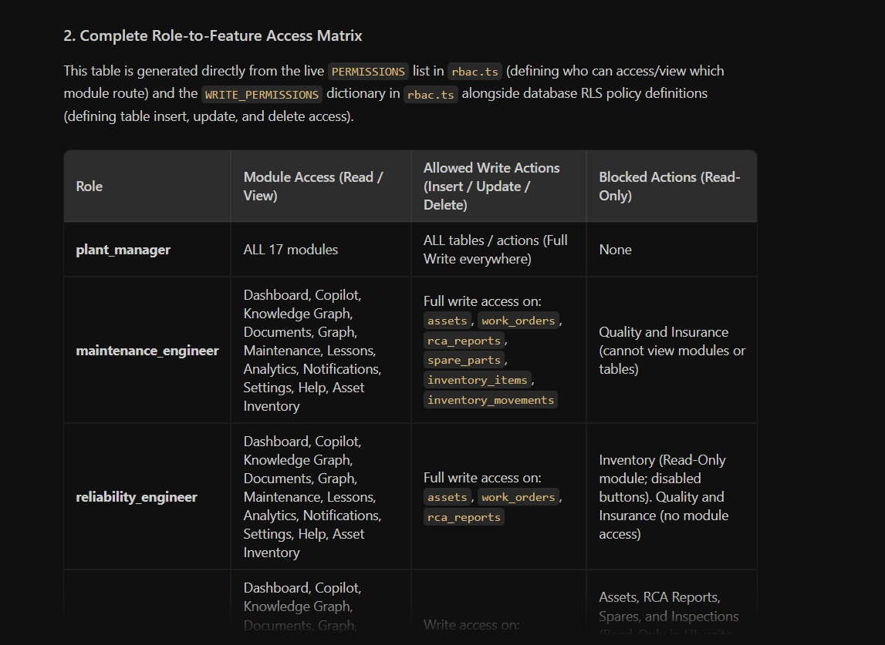
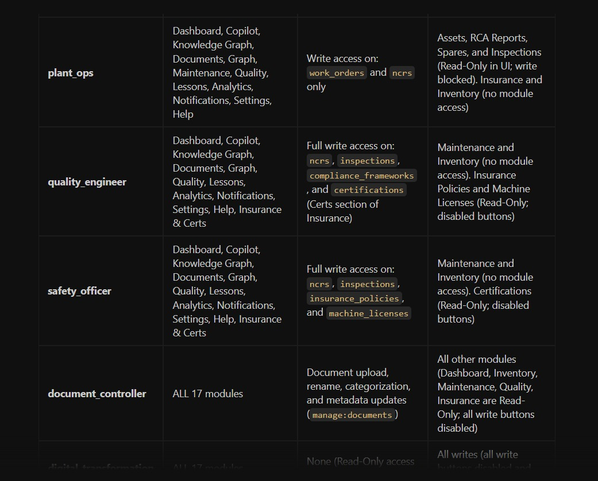
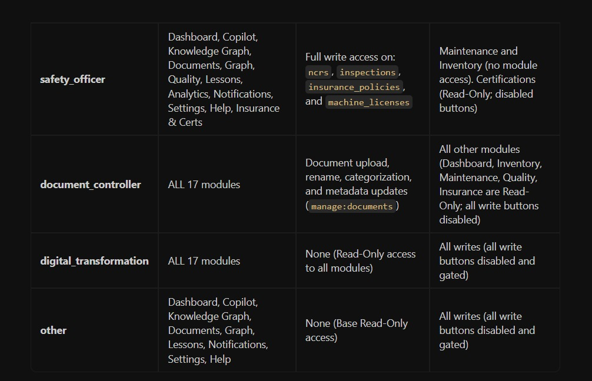

# 🏭 Ctrl+She – AI-Powered Industrial Knowledge Platform

# 🌐 Live Demo

🚀 **Live Application:**  
👉 https://ctrl-she.vercel.app

🎥 **Project Demo Video:**  
👉 (https://drive.google.com/drive/folders/1CMPMVG6EmxGlR0JImjYzfXSGg95Ay-Og)


---


# 📖 Overview

Ctrl+She is an **AI-powered Industrial Knowledge Management Platform** designed to centralize industrial documentation, maintenance records, compliance reports, safety documentation, insurance records, certifications, and asset intelligence into a single intelligent workspace.

Instead of searching through multiple folders and disconnected systems, engineers can simply ask questions in natural language and instantly receive accurate answers backed by AI.

---

# 🎯 Problem Statement

Industrial organizations face several challenges:

- Engineers spend significant time searching for information.
- Documents are scattered across multiple storage systems.
- Critical operational knowledge is lost when experienced employees retire.
- Compliance documentation is difficult to manage.
- Maintenance history is difficult to analyze.
- Asset documentation lacks centralization.
- Manual report generation increases operational delays.

Ctrl+She solves these challenges by creating a unified AI-powered industrial knowledge hub.

---

# 💡 Our Solution

Ctrl+She is more than a document management system—it is an **AI-powered Industrial Operations Brain** that transforms fragmented industrial knowledge into a centralized, intelligent, and searchable platform.

Our solution combines Artificial Intelligence, role-based access control, secure authentication, and industrial asset management into one unified ecosystem. Instead of switching between multiple systems for maintenance records, compliance documents, safety reports, manuals, and asset information, users can access everything from a single dashboard.

Unlike traditional document repositories, Ctrl+She understands the context of industrial documents and enables engineers to ask questions in natural language. The AI Assistant retrieves relevant information from uploaded documents and provides accurate, citation-backed responses, helping teams make faster and more informed decisions.

The platform also digitizes maintenance workflows, compliance tracking, insurance management, certification records, inventory monitoring, and Root Cause Analysis (RCA), creating a complete digital workspace for modern manufacturing industries.

---

# 🚀 Key Innovations & Customizations

Our implementation extends beyond the original problem statement by introducing several practical industry-focused enhancements:

### 🤖 AI-Powered Knowledge Copilot
- Natural language AI assistant for industrial documentation
- Citation-backed answers from uploaded documents
- Semantic search for faster information retrieval
- Intelligent document understanding

### 🏭 Unified Asset Intelligence
- Complete asset inventory management
- Machine lifecycle tracking
- Equipment health monitoring
- Maintenance history
- Warranty tracking

### 🛠 Smart Maintenance Management
- Preventive Maintenance
- Corrective Maintenance
- Predictive Maintenance
- Root Cause Analysis (RCA)
- Maintenance analytics dashboard

### 📦 Inventory & Spare Parts Management
- Spare parts inventory
- Current stock monitoring
- Minimum stock alerts
- Purchase request management
- Asset procurement tracking

### 📑 Insurance, Licenses & Certifications
One of our major customizations was introducing a dedicated module for:

- Machine Insurance Management
- Equipment Licenses
- Regulatory Certifications
- Expiry tracking
- Renewal reminders

This ensures organizations never miss critical compliance deadlines.

### ✅ Quality & Compliance Intelligence
- Non-Conformance Reports (NCR)
- Compliance Framework Mapping
- Inspection Management
- Audit Readiness
- ISO and Industrial Compliance Tracking

### 🦺 Safety Management
- Safety incident reporting
- Near Miss reporting
- Risk assessment
- Safety inspection records
- Workplace compliance monitoring

### 👥 Role-Based Workspace
Every user sees a personalized workspace based on their responsibilities.

Supported roles include:

- Plant Manager
- Maintenance Engineer
- Reliability Engineer
- Quality Engineer
- Safety Officer
- HSE Engineer
- Production Engineer
- Plant Operations Engineer
- QA Manager

Each role has customized permissions using Role-Based Access Control (RBAC).

### 🔐 Enterprise-Grade Security
- Secure Supabase Authentication
- Row-Level Security (RLS)
- Protected Routes
- JWT Authentication
- Role-Based Authorization

### 📊 Advanced Analytics Dashboard
Interactive dashboards provide insights into:

- Asset Health
- Maintenance KPIs
- Compliance Status
- Inventory Overview
- AI Usage Analytics
- Department Performance

---

# 🌟 What Makes Ctrl+She Different?

Unlike conventional maintenance or document management systems, Ctrl+She combines multiple industrial functions into a single intelligent platform.

Our solution integrates:

- 📄 AI-powered Knowledge Management
- 🏭 Asset Management
- 🛠 Maintenance Intelligence
- 📦 Inventory Management
- 📑 Insurance & Certification Tracking
- ✅ Compliance Management
- 🦺 Safety Reporting
- 📊 Business Analytics
- 🤖 AI Copilot
- 🔐 Secure Role-Based Access Control

This creates a true **Industry 4.0 Digital Operations Brain**, enabling engineers, quality teams, maintenance teams, and management to collaborate efficiently from one centralized platform.

# 👥 User Roles

| Role | Access |
|-------|---------|
| Plant Manager | Full Access |
| Maintenance Manager | Maintenance + Assets + Analytics |
| Maintenance Engineer | Maintenance + RCA |
| Production Engineer | Production Documents |
| Plant Operations Engineer | Asset Operations |
| Reliability Engineer | Predictive Maintenance |
| Quality Engineer | Quality Documents |
| QA Manager | Compliance |
| Safety Officer | Safety Reports |
| HSE Engineer | Safety & Compliance |

---

# 🏗 System Architecture

```text

                        +-------------------------+
                        |      React Frontend     |
                        |  (Vite + TypeScript)    |
                        +-----------+-------------+
                                    |
                                    |
                          REST API / Supabase SDK
                                    |
                                    |
                  +-----------------+-----------------+
                  |                                   |
                  |         Supabase Backend          |
                  |-----------------------------------|
                  | Authentication                    |
                  | Database                          |
                  | Storage                           |
                  | Row Level Security                |
                  +-----------------+-----------------+
                                    |
          -----------------------------------------------------
          |                |                |                 |
          |                |                |                 |
    Asset Data      Maintenance      Documents        Compliance
          |                |                |                 |
          -----------------------------------------------------
                                    |
                                    |
                            AI Processing Layer
                                    |
                      Semantic Search + AI Chat
                                    |
                           Knowledge Responses

```

---

# 🗄 Database Architecture

```text

Users
│
├── Roles
│
├── Departments
│
├── Assets
│      │
│      ├── Maintenance
│      ├── Insurance
│      ├── Licenses
│      ├── Certifications
│
├── Documents
│
├── RCA Reports
│
├── NCR Reports
│
├── Safety Reports
│
└── Analytics

```

---

# ⚙ Technology Stack

## Frontend

- React 19
- TypeScript
- Vite
- Tailwind CSS
- ShadCN UI
- React Router

---

## Backend

- Supabase
- Authentication
- Row Level Security
- REST APIs

---

## Database

- PostgreSQL (Supabase)

Features:

- Foreign Keys
- Row Level Security
- Relationships
- Real-time Database
- Storage Buckets

---

## AI

- AI Chat
- Semantic Search
- Intelligent Document Retrieval
- Natural Language Processing

---

# 📂 Project Structure

```text

Ctrl-She/

│

├── src/

│   ├── components/

│   ├── pages/

│   ├── hooks/

│   ├── lib/

│   ├── services/

│   ├── routes/

│   └── styles/

│

├── public/

├── supabase/

│

├── docs/

│

├── package.json

├── vite.config.ts

└── README.md

```

---

# 🔑 Environment Variables

Create a `.env` file.

```env

VITE_SUPABASE_URL=your_supabase_url

VITE_SUPABASE_ANON_KEY=your_supabase_key

```

---

## 📸 Project Screenshots

### Synapse


### Roles Explanation


### Explanation 2


### Explanation 3


---

# 🔄 Application Workflow

```text

User Login
      │
      ▼
Authentication
      │
      ▼
Dashboard
      │
      ├──────── Assets
      │
      ├──────── Documents
      │
      ├──────── Maintenance
      │
      ├──────── Compliance
      │
      ├──────── Safety
      │
      └──────── AI Chat
                    │
                    ▼
           AI Knowledge Search
                    │
                    ▼
         Intelligent Response

```

---

# 🔐 Security

- Supabase Authentication
- Role Based Access Control
- Row Level Security
- Secure Storage
- Protected Routes
- JWT Authentication

---

# 📊 Future Improvements

- Voice Assistant
- OCR for Scanned Manuals
- IoT Integration
- Predictive Maintenance AI
- Mobile Application
- Digital Twin Integration
- ERP Integration
- SAP Integration

---

# 👨‍💻 Team

### Team Ctrl+She

AI Powered Industrial Knowledge Platform

Hackathon Project

---

# 📜 License

This project is licensed under the MIT License.

---
